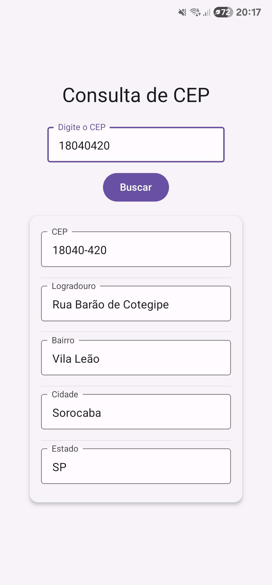

# Consulta de CEP

App React Native para consultar endereços via CEP usando a API do ViaCEP.

## Imagens

<div style="display: flex; gap: 20px; align-items: center;">
  <div>
    <h4>Tela para inserir CEP</h4>
    
  </div>
  <div>
    <h4>Resultado da consulta</h4>
    
  </div>
</div>

## Como usar

1. Digite um CEP válido
2. Pressione "Buscar"
3. Veja as informações do endereço

## Tecnologias

- React Native + Expo
- React Native Paper
- ViaCEP API

## Executar

```bash
npm install
npm start
```

## Estrutura

```
viacep/
├── App.js          # App principal
├── app.json        # Config Expo
├── package.json    # Dependências
└── assets/         # Ícones
```